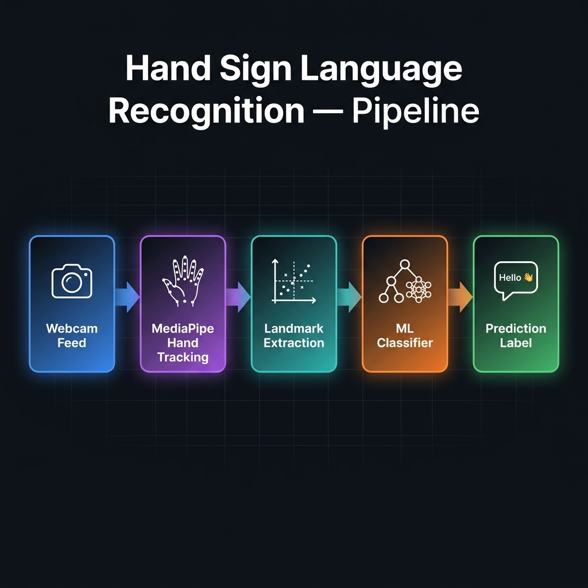

<div align="center">

# 🤟 Hand Sign Language Recognition

**Real-time ASL gesture classification using MediaPipe, scikit-learn, XGBoost & TensorFlow**


</div>

---

## 📌 Overview

This project builds a real-time hand sign language recognition system from scratch — from webcam data collection to live inference. It uses **MediaPipe** to extract 21 hand landmark coordinates per frame and trains three classifiers (Random Forest, XGBoost, and a Keras Neural Network) to classify gestures with 100% accuracy on the 3-class dataset.

---

## 🎯 Pipeline



| Step | Notebook | Script |
|------|----------|--------|
| 1. Data Collection | `notebooks/01_data_collection.ipynb` | `python src/collect_data.py` |
| 2. Preprocessing | `notebooks/02_data_preprocessing.ipynb` | `python src/preprocess.py` |
| 3. Model Training | `notebooks/03_model_training.ipynb` | `python src/train.py` |
| 4. Real-Time Inference | `notebooks/04_real_time_inference.ipynb` | `python src/inference.py` |

---

## 📊 Model Results

All three models achieve **100% accuracy** on the 3-class held-out test set (80/20 split).

| Model | Accuracy | Precision | Recall | F1 Score |
|-------|----------|-----------|--------|----------|
| Random Forest | **100.00%** | 1.00 | 1.00 | 1.00 |
| XGBoost | **100.00%** | 1.00 | 1.00 | 1.00 |
| Neural Network | **100.00%** | 1.00 | 1.00 | 1.00 |

> The **Random Forest** is selected as the production model for inference — it is fast, lightweight, and interpretable with no additional deep-learning runtime required.

**Recognised gestures:**

| Class | Gesture |
|-------|---------|
| 0 | ✋ Hello |
| 1 | 👍 Yes |
| 2 | 🤟 I Love You |

---

## 🗂️ Project Structure

```
hand-sign-language/
├── notebooks/
│   ├── 01_data_collection.ipynb      # Webcam image capture
│   ├── 02_data_preprocessing.ipynb   # MediaPipe landmark extraction
│   ├── 03_model_training.ipynb       # Train RF / XGBoost / NN + evaluation
│   └── 04_real_time_inference.ipynb  # Live webcam inference
├── src/
│   ├── __init__.py
│   ├── config.py          # Central config — paths, labels, hyperparams
│   ├── collect_data.py    # Standalone data collection script
│   ├── preprocess.py      # Standalone preprocessing script
│   ├── train.py           # Standalone Random Forest training script
│   └── inference.py       # Standalone real-time inference script
├── assets/
│   ├── pipeline.png       # Architecture diagram
│   ├── confusion_matrix.png
│   └── training_curves.png
├── models/                # ← gitignored (model.p lives here after training)
├── data/                  # ← gitignored (captured images live here)
├── requirements.txt
├── .gitignore
└── README.md
```

---

## ⚙️ Installation

### 1. Clone the repository

```bash
git clone https://github.com/araizahmadd/hand-sign-language.git
cd hand-sign-language
```

### 2. Create and activate a virtual environment

```bash
python -m venv .venv
source .venv/bin/activate       # macOS / Linux
.venv\Scripts\activate          # Windows
```

### 3. Install dependencies

```bash
pip install -r requirements.txt
```

---

## 🚀 Usage

### Step 1 — Collect Data
Capture 150 images per gesture from your webcam. Press `Q` when prompted.

```bash
python src/collect_data.py
# or, for custom number of classes and images:
python src/collect_data.py --classes 3 --size 200
```

### Step 2 — Preprocess

Extract and normalise MediaPipe hand landmarks from all collected images.

```bash
python src/preprocess.py
```

### Step 3 — Train

Train the Random Forest classifier and save the model.

```bash
python src/train.py
```

### Step 4 — Inference

Run real-time gesture recognition from your webcam. Press `Q` to quit.

```bash
python src/inference.py
# or, for an external webcam:
python src/inference.py --camera 1
```

> You can also follow along interactively in the `notebooks/` folder.

---

## 🧠 How It Works

1. **MediaPipe Hands** detects 21 landmarks (x, y coordinates) on the hand.
2. Coordinates are **normalised** relative to the hand's bounding box, making them invariant to hand position and scale in the frame.
3. The 42 normalised values (21 × x + 21 × y) form the **feature vector** fed into the classifier.
4. A **Random Forest** (100 estimators) classifies the gesture in real time.

---

## ⚠️ Limitations & Future Work

- Currently trained on **3 gestures** — extending to the full ASL alphabet (26 letters) requires more data collection.
- Dataset is small (150 images/class) and from a single user — a larger, more diverse dataset would improve generalisation.
- The model may struggle in poor lighting conditions or at extreme hand angles.

**Potential improvements:**
- Expand to full 26-letter ASL alphabet
- Add temporal context (LSTM / Transformer) for dynamic signs
- Deploy as a web app (FastAPI + WebRTC)
- Add multi-hand support

---

## 🪪 License

This project is licensed under the **MIT License** — see [LICENSE](LICENSE) for details.

---

<div align="center">
Made with ❤️ by <a href="https://github.com/araizahmadd">araizahmadd</a>
</div>
